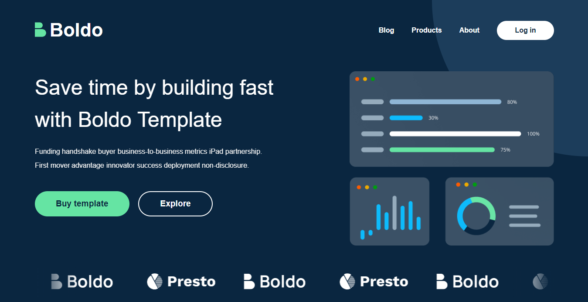

# Boldo Template

Boldo Multi-Page Template Website.

## Table of contents

- [Boldo Template](#boldo-template)
  - [Table of contents](#table-of-contents)
  - [Overview](#overview)
    - [Screenshot](#screenshot)
    - [Links](#links)
    - [Built with](#built-with)
    - [Installation](#installation)
    - [Author](#author)
    - [Mentor](#mentor)
    - [Mentee](#mentee)
    - [Acknowledgement](#acknowledgement)

## Overview

### Screenshot

### Links

- Live Site URL: [Click here](https://daalu-boldo.netlify.app/)

### Built with

- React.js
- Semantic HTML5 markup
- CSS3
- Mobile-first workflow
- Swiper.js

### Installation

- Clone repo into your drive
- cd into the repo
- run npm install on the terminal
- after installation of packages, run npm start

### Author

- Twitter - [@Dhevine_0X](https://www.twitter.com/Dhevine_0X)
- - GitHub - [Heisdalu](https://github.com/Heisdalu)

### Mentor

- Faith Pueneh

### Mentee

- Divine Obi

### Acknowledgement
- Edgar Allan designed it from the figma community.
